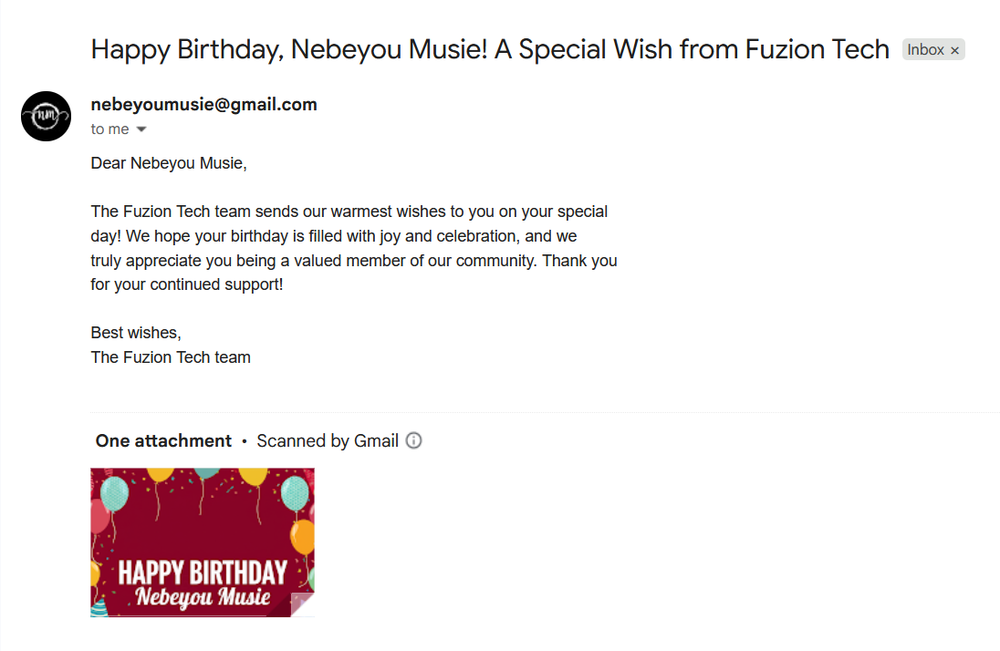

# Birthday Wish Automation with n8n

Automate personalized birthday greetings for your customers effortlessly with n8n! This project automatically sends customized birthday emails with AI-generated images to strengthen customer relationships and enhance engagement.


---

## Table of Contents

- [Overview](#overview)
- [How It Works](#how-it-works)
  - [Workflow Steps](#workflow-steps)
- [Benefits](#benefits)
- [Requirements](#requirements)
- [Setup Instructions](#setup-instructions)
  - [1. Clone or Import Workflow](#1-clone-or-import-workflow)
  - [2. Connect Google Sheets](#2-connect-google-sheets)
  - [3. Connect Gmail](#3-connect-gmail)
  - [4. Configure Gemini AI](#4-configure-gemini-ai)
  - [5. Customize Birthday Messages](#5-customize-birthday-messages)
  - [6. Schedule the Trigger](#6-schedule-the-trigger)
  - [7. Test the Workflow](#7-test-the-workflow)
- [Customization](#customization)
  - [Customer Data Sheet Structure](#customer-data-sheet-structure)
  - [AI Message Personalization](#ai-message-personalization)
  - [Image Generation Customization](#image-generation-customization)
- [Troubleshooting](#troubleshooting)
- [Contributing](#contributing)
- [License](#license)
- [Contact](#contact)

---

## Overview

**Birthday Wish Automation** is an n8n workflow designed for businesses and customer service teams. It:

- Automatically sends personalized birthday greetings to customers on their special day
- Generates custom birthday images using AI (Gemini) for each customer
- Creates warm, professional messages using AI language models
- Tracks sent greetings to prevent duplicates
- Runs on a daily schedule, ensuring no customer birthday is missed

---

## How It Works


### Workflow Steps

1. **Schedule Trigger**
   - Initiates the workflow daily at 6:00 AM
   - Ensures timely birthday greetings

2. **Get Row(s) in Sheet**
   - Retrieves all customer records from Google Sheets
   - Accesses customer names, email addresses, and birth dates

3. **Filter Unsent Messages**
   - Filters customers where "Birthday Wish Sent" column is "No"
   - Prevents duplicate birthday greetings

4. **IF (Birthday Check)**
   - Checks if today's date matches the customer's date of birth
   - Only processes customers whose birthday is today

5. **Generate Subject and Message**
   - Uses Gemini AI to create personalized birthday messages
   - Generates both email subject and body content
   - Ensures warm, professional communication

6. **Generate Birthday Image**
   - Creates custom birthday greeting images using Gemini AI
   - Features customer name prominently with company branding
   - Optimized for email attachments (800x400 pixels)

7. **Send Birthday Email**
   - Delivers personalized birthday message via Gmail
   - Includes the custom AI-generated birthday image
   - Sends to customer's email address

8. **Update Sheet**
   - Marks "Birthday Wish Sent" column as "Yes"
   - Prevents duplicate greetings in future runs

---

## Benefits

- **Strengthens customer relationships** with personalized birthday recognition
- **Automates special occasion engagement** without manual tracking
- **Saves time** compared to manual birthday wish management
- **Enhances brand perception** with professional, timely greetings
- **Prevents duplicate messages** through automated tracking
- **Creates memorable customer experiences** with custom AI-generated content

---

## Requirements

- [n8n](https://n8n.io/) installation or cloud account
- Google account with:
  - Access to Google Sheets (customer database)
  - Access to Gmail (for sending emails)
  - Gemini AI API access (for message and image generation)
- Customer data in Google Sheets with birth dates

---

## Setup Instructions

### 1. Clone or Import Workflow

- Download or import the attached `Birthday Wish Automation.json` workflow in your n8n instance
- Use the Visual editor or Desktop version for easy setup

### 2. Connect Google Sheets

- Add your Google Sheets credentials in n8n
- Configure the sheet ID and worksheet name
- Ensure your sheet contains customer data with birth dates

### 3. Connect Gmail

- Add your Gmail credentials to the email node in n8n
- Verify permissions for sending automated emails
- Test email functionality before deployment

### 4. Configure Gemini AI

- Add your Google Gemini API credentials in n8n
- Configure the AI model settings for optimal performance
- Set appropriate rate limits and API quotas

### 5. Customize Birthday Messages

- Edit the AI prompt in the "Generate Subject and Message" node
- Customize the image generation prompt for your brand style
- Adjust message tone and company information as needed

### 6. Schedule the Trigger

- Configure the schedule node for your preferred run time
- Daily morning triggers (6:00 AM) are recommended
- Consider your customer's time zones

### 7. Test the Workflow

- Run the workflow manually to verify all connections
- Check Gmail sent folder for test emails
- Verify Google Sheets updates correctly

---

## Customization

### Customer Data Sheet Structure

Your Google Sheets should include these essential columns:


- **Customer Name**: Full name for personalization
- **Email Address**: Customer's email for sending greetings
- **Date of Birth**: Birth date in MM/DD/YYYY format
- **Birthday Wish Sent**: "Yes" or "No" to track sent greetings

### AI Message Personalization

The workflow automatically personalizes messages using customer data:



**Subject**: `Happy Birthday, [Customer Name]! A Special Wish from Fuzion Tech`

**Message**: 
```
Dear [Customer Name],

We wish you a wonderful birthday filled with joy and success. Thank you for being a valued member of our community.

Best wishes,
The Fuzion Tech team
```

### Image Generation Customization

Customize the AI image generation prompt for your brand:

- **Company Name**: Update "Fuzion Tech" to your business name
- **Image Style**: Modify colors, fonts, and design elements
- **Dimensions**: Adjust image size for your email template needs
- **Branding Elements**: Include your logo or brand colors

---

## Troubleshooting

- **Google Sheets connection fails**: Check API permissions and sheet ID
- **Gmail authentication errors**: Verify OAuth2 credentials and permissions
- **Gemini AI failures**: Check API quotas and authentication
- **Image generation issues**: Review prompt formatting and API limits
- **Workflow scheduling problems**: Check n8n instance status and cron expressions
- **Duplicate emails**: Verify "Birthday Wish Sent" column updates properly

---

## Contributing

Contributions and suggestions are welcome!  
Fork the repo, submit issues, or create pull requests for workflow improvements.

---

## License

This project is licensed under the MIT License.

---

## Contact

- **Email:** nebeyoumusie@gmail.com
- **LinkedIn:** [LinkedIn](https://www.linkedin.com/in/nebeyou-musie)
- **X(Twitter):** [X](https://x.com/NebeyouMusie)
- **Upwork:** [Upwork](https://www.upwork.com/freelancers/~017ff01729e3cd26e0?mp_source=share)
- **My Agency:** [Fuzion Tech Website](https://fuzion-tech.com/) or [Fuzion Tech on Upwork](https://www.upwork.com/agencies/1948388369189366041/)

---

**Skills & Technologies:**  
`n8n`, `Gemini`, `Customer Care`, `Gmail`, `Google Sheets Automation`

---

**Enjoy automated birthday greetings and enhanced customer relationships!**

---

> _For any issues, please contact the project maintainer or open an issue on your workflow repository.
